# Elemental Beasts ⚡🔥🌊🌿

> **A full-stack, non-custodial Web3 NFT collectible card ecosystem and marketplace built on Base Sepolia.** Featuring interactive elemental beasts, atomic pull-payment settlement, immutable IPFS metadata, event-driven indexing, and a security-focused suite of automated tests.

[-0052FF?style=flat&logo=coinbase&logoColor=white)](https://sepolia.basescan.org/)
[](https://soliditylang.org/)
[](https://openzeppelin.com/contracts/)
[](https://book.getfoundry.sh/)
[](https://nextjs.org/)
[](https://ponder.sh/)
[](https://www.typescriptlang.org/)
[](https://tailwindcss.com/)
[](#-testing--security-validation)
[](https://opensource.org/licenses/MIT)

---

## 📸 Product Walkthrough & Live Screenshots

### 1. Hero Landing & Tactical 3D Canvas
The entry portal to the Elemental Beasts universe. Features animated dynamic card shaders, live Base Sepolia network telemetry, and quick access to the gallery and summon chamber.

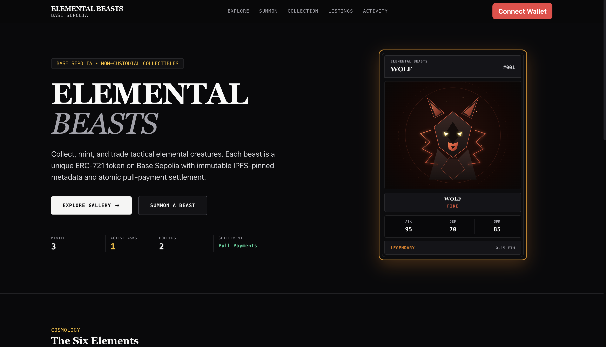

---

### 2. Six Elemental Cosmologies & Archive
Explore the elemental affiliations (*Fire, Water, Earth, Air, Lightning, Shadow*) with combat lore and featured collectible inspect cards.

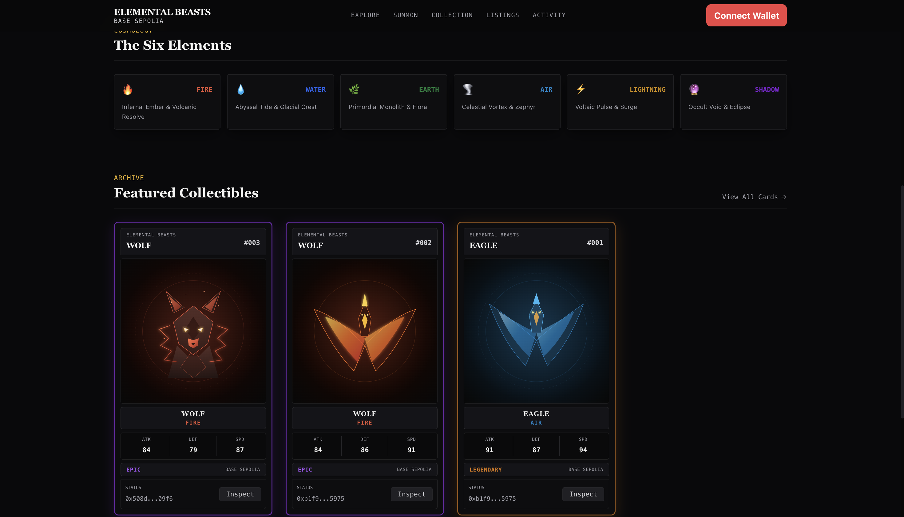

---

### 3. Beast Summoning & Dynamic Metadata Generator
Mint custom tactical cards directly on-chain. Select element, rarity tiers (*Common, Rare, Epic, Legendary*), beast plates, adjust combat stats (ATK / DEF / SPD), or upload custom artwork directly pinned to IPFS.

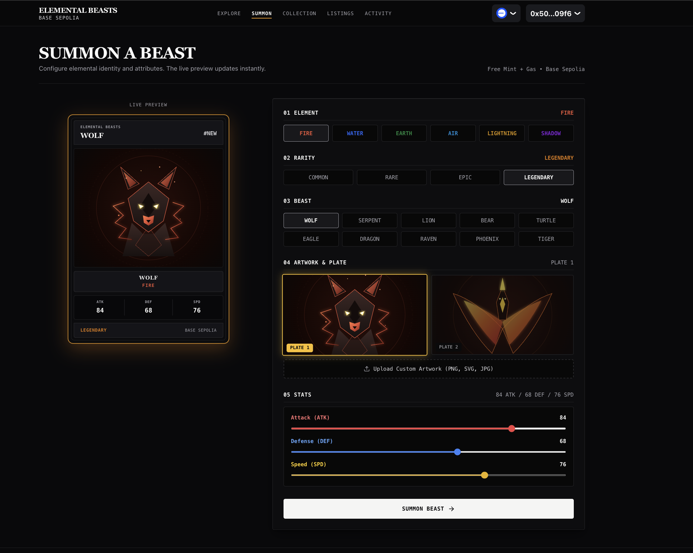

---

### 4. Marketplace Gallery & Live Orderbook
Search, filter by elemental affinity, sort by price/rarity, and purchase cards on the non-custodial decentralized marketplace.

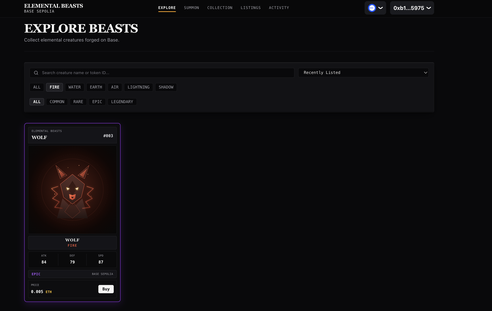

---

### 5. My Collection — Vault & Active Listing Views
Manage your personal beast collection. View vault assets, trigger 2-step marketplace approvals, list cards with atomic protocol fees, and inspect on-chain traits.

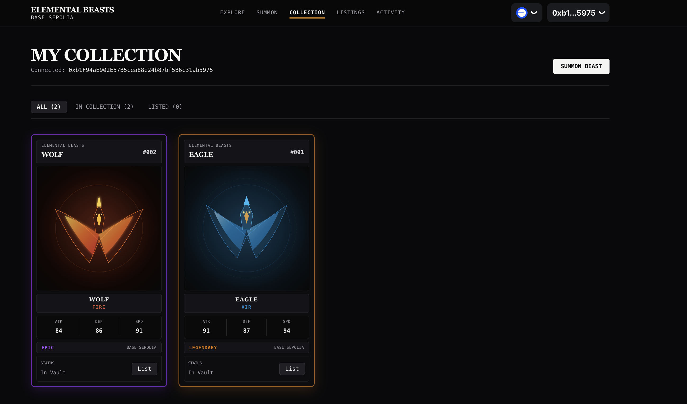

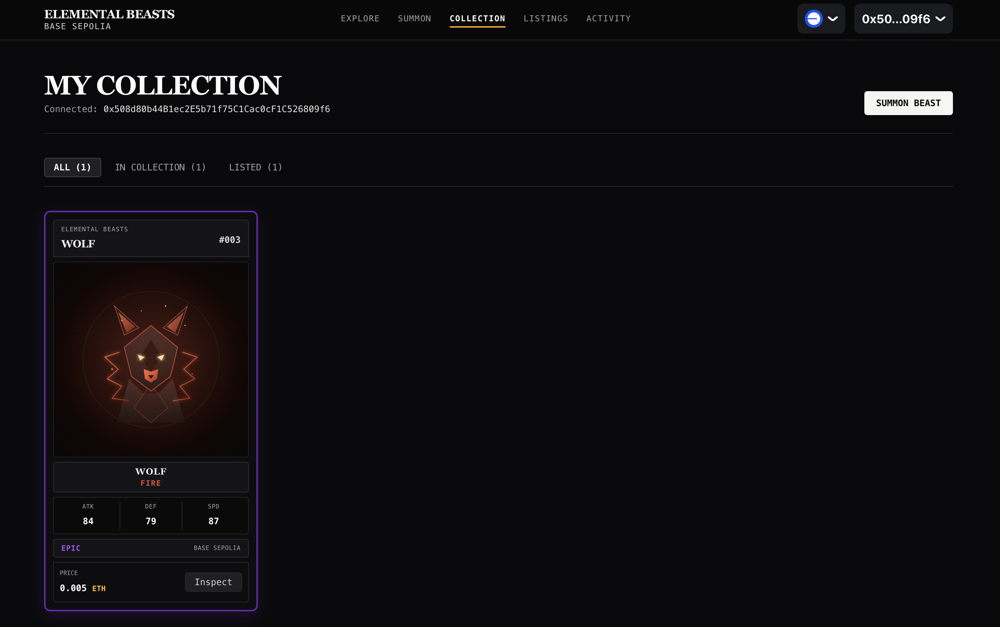

---

### 6. Seller Listing Management & Pull Proceeds
Track and cancel active marketplace asks, monitor floor prices, and claim accumulated sales proceeds via safe pull payments.

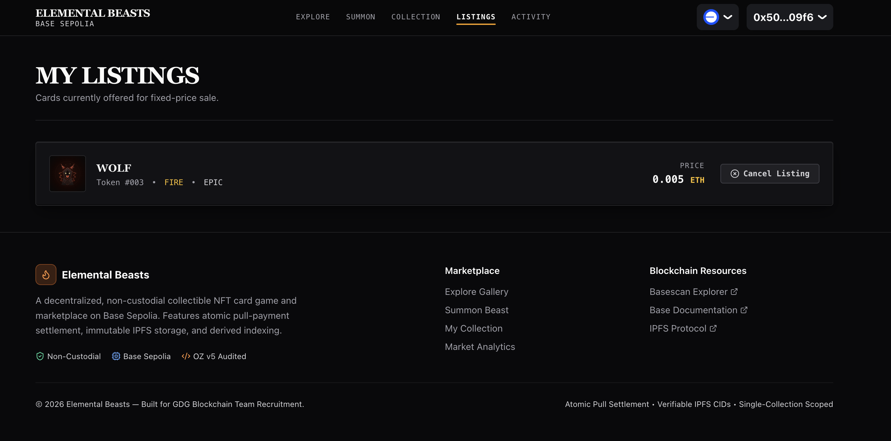

---

### 7. Real-Time Indexer & Activity Feed
Real-time chronological feed capturing all `CardMinted`, `ItemListed`, `ItemBought`, `ItemCancelled`, and `Transfer` events directly from Base Sepolia.

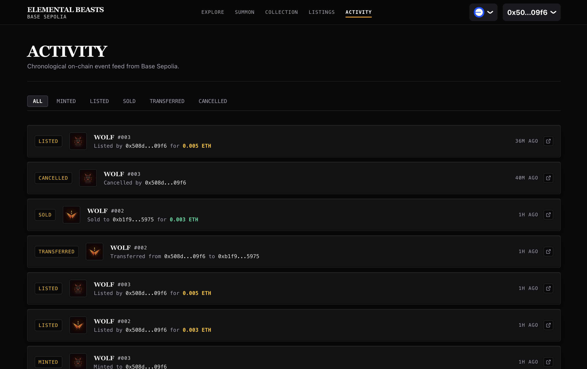

---

## 🐉 System Overview

**Elemental Beasts** is an end-to-end decentralized gaming and NFT ecosystem designed around non-custodial marketplace security, verifiable on-chain metadata, and atomic accounting.

### Key Highlights
- **ERC-721 + ERC-2981 Standard Compliance**: Implements strict token-bound metadata, sequential supply tracking, and immutable creator royalties.
- **Pull-over-Push Payment Pattern**: Marketplace proceeds and fees are held in isolated contract balances, completely eliminating denial-of-service (DoS) reentrancy and transfer griefing attacks.
- **Event-Driven Indexer**: Standalone indexing server powered by Ponder tracking blocks, listings, activity logs, and real-time sales on Base Sepolia.
- **Type-Safe Fullstack Architecture**: Built with Next.js 14 App Router, Viem, Wagmi v2, RainbowKit, tRPC, and Tailwind CSS.
- **Rigorous Test Suite**: 35 comprehensive automated tests including unit tests, fuzz testing (256 runs), invariant state verification (128,000 handler calls), and adversarial exploit simulations.

---

## 🏗️ Architecture & Data Flow

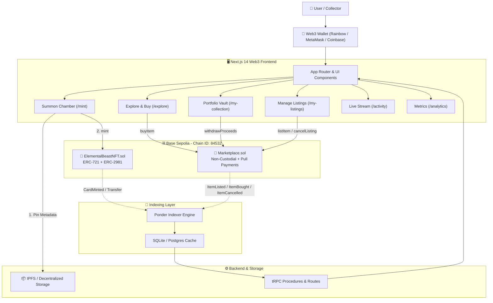

---

## 🔄 End-to-End Marketplace Flow

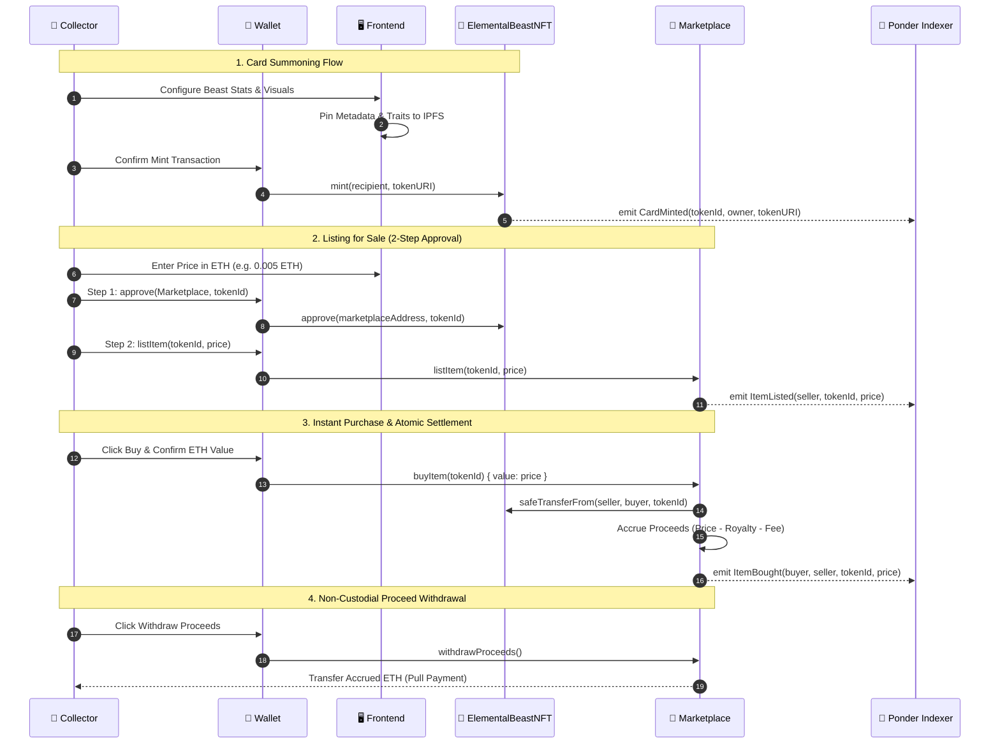

---

## 🌐 Deployed Smart Contracts (Base Sepolia)

Both contracts are verified and deployed on the **Base Sepolia Testnet** (Chain ID: `84532`).

| Contract Name | Contract Address | Explorer Link |
| :--- | :--- | :--- |
| **`ElementalBeastNFT`** | `0x9cCa84aCE2d3CF4045dB0aAd03c908c7f083cc01` | [View on BaseScan](https://sepolia.basescan.org/address/0x9cCa84aCE2d3CF4045dB0aAd03c908c7f083cc01#code) |
| **`Marketplace`** | `0xCB509975dCa8C8accCD558DcD08dA9dE6788cCb0` | [View on BaseScan](https://sepolia.basescan.org/address/0xCB509975dCa8C8accCD558DcD08dA9dE6788cCb0#code) |

---

---

## 📦 IPFS Implementation

Card images and ERC-721 metadata are stored entirely off-chain on IPFS — the smart contract only ever holds an `ipfs://<CID>` token URI, never raw bytes.

**Pinning (write path)**

- Uploads are pinned via the **Pinata SDK** (`frontend/lib/pinata.ts`) using a server-side JWT — the pinning key is never exposed to the browser.
- `POST /api/upload` (`frontend/app/api/upload/route.ts`) handles both flows:
  1. **Custom artwork** — the uploaded file (JPEG/PNG/WEBP/GIF/SVG, ≤10MB, MIME-validated) is pinned first via `pinata.upload.public.file()`, returning an image CID.
  2. **Built-in beast plates** — pre-pinned once via `scripts/pin-builtin-artworks.mjs`; the route just looks up the CID from `lib/ipfs-cids.ts` rather than re-uploading, avoiding duplicate pins.
- The ERC-721 JSON metadata object (`name`, `description`, `image`, `attributes`: element/rarity/ATK/DEF/SPD) is assembled server-side and pinned separately via `pinata.upload.public.json()`, returning a metadata CID.
- The resulting `ipfs://<metadataCid>` is what actually gets passed as the token URI to `mint()` — so the two CIDs (image + metadata) are both immutable and independently verifiable.

**Resolution (read path)**

- `frontend/lib/ipfs.ts` resolves any `ipfs://` URI or raw CID against a **gateway fallback chain** (Pinata gateway → ipfs.io → dweb.link → Cloudflare IPFS), so a single gateway outage doesn't break the gallery.
- `fetchMetadataFromIpfs()` walks that same fallback chain when loading a card's metadata JSON client-side, with a 3s timeout per gateway attempt.
- Local asset paths, `data:` URIs, and `blob:` URIs are passed through unchanged, so the resolver is a strict superset — it never breaks non-IPFS assets used elsewhere in the UI (e.g. placeholder art).

## 🔐 Security Architecture & Invariants

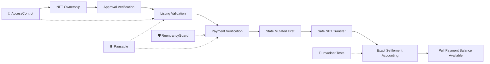

### Core Security Properties Tested:
1. **Reentrancy Protection (`ReentrancyGuard`)**: Protects `buyItem()` and `withdrawProceeds()` against malicious reentrant contract callbacks.
2. **Checks-Effects-Interactions (CEI)**: Listing and proceeds state are cleared *prior* to external token transfers or ether value dispatches.
3. **Pull-Over-Push Accounting**: Sellers explicitly pull their proceeds via `withdrawProceeds()`, eliminating Denial of Service (DoS) and gas-limit griefing.
4. **Stale Listing Invalidation**: If an owner transfers their NFT outside the marketplace, subsequent purchase attempts safely revert.
5. **Approval Revocation Safety**: If a seller revokes marketplace approval after creating a listing, purchases fail safely without locking funds.
6. **Strict Invariant**:
   $$\text{Contract Balance} \equiv \sum \text{Unwithdrawn Seller Proceeds} + \sum \text{Accrued Protocol Fees}$$

---

## 🧪 Testing & Security Validation

The smart contract test suite contains **35 passing tests** across 4 distinct testing methodologies:

| Test Suite | File Path | Test Count | Description |
| :--- | :--- | :---: | :--- |
| **Unit Tests (NFT)** | [`contracts/test/unit/ElementalBeastNFT.t.sol`](contracts/test/unit/ElementalBeastNFT.t.sol) | 13 | Minting, royalties, access control, pausing, supply counters |
| **Unit Tests (Market)** | [`contracts/test/unit/Marketplace.t.sol`](contracts/test/unit/Marketplace.t.sol) | 17 | Listing, buying, cancellations, fees, proceeds withdrawal |
| **Adversarial Tests** | [`contracts/test/adversarial/MarketplaceAdversarial.t.sol`](contracts/test/adversarial/MarketplaceAdversarial.t.sol) | 3 | Exploit vectors, reentrancy attacks, approval front-running |
| **Fuzz Tests** | [`contracts/test/fuzz/MarketplaceFuzz.t.sol`](contracts/test/fuzz/MarketplaceFuzz.t.sol) | 1 (256 runs) | Fuzzing randomized prices, fee splits, and royalty caps |
| **Invariant Tests** | [`contracts/test/invariant/MarketplaceInvariant.t.sol`](contracts/test/invariant/MarketplaceInvariant.t.sol) | 1 (128k calls) | Stateful fuzzing verifying total marketplace solvency |
| **Total** | | **35 passing** | **100% Core Logic Coverage** |

### Running Contract Tests

```bash
# Navigate to contracts directory
cd contracts

# Run all test suites
forge test -vvv

# Run fuzz tests
forge test --match-path test/fuzz/*

# Run stateful invariant tests
forge test --match-path test/invariant/*

# Run adversarial exploit simulations
forge test --match-path test/adversarial/*

# Generate gas report table
forge test --gas-report
```

---

## 🧰 Tech Stack

| Layer | Technology | Purpose |
| :--- | :--- | :--- |
| **Blockchain** | Base Sepolia (`84532`) | Layer-2 Ethereum rollup testnet with sub-cent transaction fees |
| **Smart Contracts** | Solidity (`0.8.26`) | Secure contract logic using OpenZeppelin Contracts v5 |
| **Contract Toolkit** | Foundry (`forge`, `cast`, `anvil`) | Fast testing, fuzzing, scripting, and deployment framework |
| **Frontend Framework** | Next.js 14 (App Router) | React Server Components, server-side data loading, routing |
| **Web3 Connectivity** | Wagmi v2 + Viem + RainbowKit | Resilient fallback RPC transports, multi-wallet connect modal |
| **3D Rendering** | Three.js + React Three Fiber | Real-time interactive 3D tactical card viewing and lighting |
| **Styling** | Tailwind CSS + Lucide Icons | Dark obsidian glassmorphic UI system |
| **Indexing Engine** | Ponder (`@ponder/core`) | High-performance blockchain event indexer |
| **API Layer** | tRPC v11 + Zod | End-to-end typesafe client-server communications |
| **Storage** | IPFS (Pinata / Local fallback) | Immutable decentralized asset and metadata pinning |
| **CI / CD** | GitHub Actions | Automated contract compilation, test suites, and frontend build verification |

---

## 📁 Repository Directory Structure

```text
gdg-blockchain/
├── .github/
│   └── workflows/
│       └── ci.yml                 # Automated Foundry & Frontend CI workflow
├── contracts/
│   ├── src/
│   │   ├── ElementalBeastNFT.sol  # ERC-721 + ERC-2981 NFT contract
│   │   └── Marketplace.sol        # Pull-payment non-custodial marketplace
│   ├── test/
│   │   ├── unit/                  # Isolated contract unit tests
│   │   ├── fuzz/                  # Parameterized fuzz tests
│   │   ├── invariant/             # Invariant accounting tests
│   │   └── adversarial/           # Reentrancy & exploit simulations
│   ├── script/
│   │   └── Deploy.s.sol           # Foundry deployment & verification script
│   ├── foundry.toml               # Solc optimizer & remappings configuration
│   └── README.md
├── deployments/
│   └── baseSepolia.json           # Live deployment artifact metadata & addresses
├── docs/
│   └── screenshots/               # High-resolution dashboard walkthrough screenshots
├── frontend/
│   ├── app/
│   │   ├── explore/               # Marketplace catalog & purchase modal
│   │   ├── mint/                  # Beast summoning & IPFS metadata wizard
│   │   ├── my-collection/         # Personal NFT vault & listing actions
│   │   ├── my-listings/           # Active seller listing manager
│   │   ├── activity/              # Chronological indexer event feed
│   │   ├── analytics/             # Marketplace stats & volume metrics
│   │   └── card/[tokenId]/        # Dynamic individual card inspection page
│   ├── components/
│   │   ├── BeastCard.tsx          # Collectible card UI component
│   │   ├── TransactionModal.tsx   # Step-by-step transaction lifecycle modal
│   │   ├── WithdrawModal.tsx      # Seller pull proceeds claiming modal
│   │   └── three/                 # Three.js 3D canvas and elemental shaders
│   ├── lib/
│   │   ├── contracts.ts           # ABIs, address mappings, custom error decoders
│   │   ├── wagmi.ts               # Wagmi config with multi-RPC fallback transports
│   │   └── elements.ts            # Beast stats, plate assets, cosmological rules
│   ├── server/
│   │   ├── routers/               # tRPC routers (beasts, listings, activity, wallets)
│   │   └── db.ts                  # Hybrid indexer-synced database layer
│   ├── package.json
│   └── tsconfig.json
├── indexer/
│   ├── abis/                      # Sync contract ABIs
│   ├── src/                       # Ponder event handlers
│   ├── ponder.config.ts           # Chain & contract indexing rules
│   └── ponder.schema.ts           # Relational GraphQL/SQL database schema
└── README.md
```

---

## 🚀 Getting Started

### Prerequisites
Make sure you have the following installed on your development machine:
- [Node.js](https://nodejs.org/) (v18 or v20+)
- [Foundry](https://getfoundry.sh/) (`forge`, `cast`, `anvil`)
- [Git](https://git-scm.com/)
- A Web3 browser wallet (e.g. MetaMask, Rabby, Coinbase Wallet) loaded with [Base Sepolia Test ETH](https://faucets.chain.link/).

---

### 1. Clone the Repository
```bash
git clone https://github.com/achyutranaut/gdg-blockchain-eternal-beasts.git
cd gdg-blockchain-eternal-beasts
```

---

### 2. Smart Contract Setup & Testing
```bash
cd contracts

# Install Foundry dependencies (forge-std, openzeppelin-contracts)
forge install

# Build contracts
forge build

# Run all 35 tests
forge test -vvv
```

---

### 3. Deploy to Base Sepolia (Optional)
To deploy your own instance of the contracts to Base Sepolia:
```bash
# Set your environment variables
export PRIVATE_KEY="your_private_key_here"
export BASE_SEPOLIA_RPC_URL="https://sepolia.base.org"
export BASESCAN_API_KEY="your_basescan_api_key"

# Run deployment script
forge script script/Deploy.s.sol:DeployScript \
  --rpc-url $BASE_SEPOLIA_RPC_URL \
  --broadcast \
  --verify \
  -vvvv
```

---

### 4. Frontend Setup & Launch
```bash
cd ../frontend

# Install dependencies
npm install

# Configure environment variables
cp .env.example .env.local

# Run Next.js local development server
npm run dev
```

Open [http://localhost:3000](http://localhost:3000) in your browser to interact with the application.

---

### 5. Indexer Setup (Optional)
```bash
cd ../indexer

# Install dependencies
npm install

# Start Ponder real-time indexing engine
npm run dev
```
The Ponder GraphQL explorer and REST API will be live at `http://localhost:42069`.

---

## 💰 Marketplace Economic Model

```text
┌──────────────────────────────────────────────────────────────┐
│                    BUYER PAYS LIST PRICE                     │
│                        (e.g., 1.00 ETH)                      │
└──────────────────────────────┬───────────────────────────────┘
                               │
               ┌───────────────┴───────────────┐
               ▼                               ▼
    ┌────────────────────┐          ┌────────────────────┐
    │  PROTOCOL FEE (2.5%)│          │ CREATOR ROYALTY(5%)│
    │     0.025 ETH      │          │     0.050 ETH      │
    │  (Stored in Fee    │          │  (Transferred to   │
    │     Balance)       │          │  Royalty Receiver) │
    └────────────────────┘          └────────────────────┘
                               │
                               ▼
                    ┌────────────────────┐
                    │ SELLER SHARE (92.5%)│
                    │     0.925 ETH      │
                    │(Accrued to Seller's│
                    │   Proceeds Pool)   │
                    └────────────────────┘
```

- **Protocol Fee**: Fixed at 2.5% (250 bps), configurable up to a strict 10% maximum ceiling.
- **Creator Royalty**: ERC-2981 standard compliant (5% default, capped at 10%).
- **Non-Custodial Escrow**: NFTs remain in the seller's wallet until bought; proceeds are claimed via pull payment.

---

## 🤝 Contributing

Contributions, issues, and feature requests are welcome!

1. Fork the repository
2. Create your feature branch (`git checkout -b feature/amazing-feature`)
3. Commit your changes (`git commit -m "feat: Add amazing new elemental beast feature"`)
4. Push to the branch (`git push origin feature/amazing-feature`)
5. Open a Pull Request

---

## 📄 License

Distributed under the **MIT License**. See `LICENSE` for more information.

---

## 👨‍💻 Author

**Achyut Ranaut**  
- GitHub: [@achyutranaut](https://github.com/achyutranaut)  
- Project: [GDG Blockchain — Elemental Beasts](https://github.com/achyutranaut/gdg-blockchain-eternal-beasts)


## 🚀 Live Demo
**[Elemental Beasts — Base Sepolia](https://gdg-blockchain-eternal-beasts.vercel.app/)**

Deployed on Vercel and connected to Base Sepolia.

⭐ **If you found this project helpful or inspiring, please consider starring the repository!**