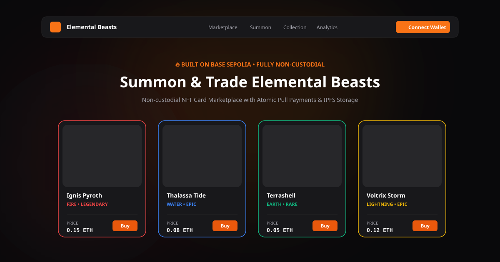
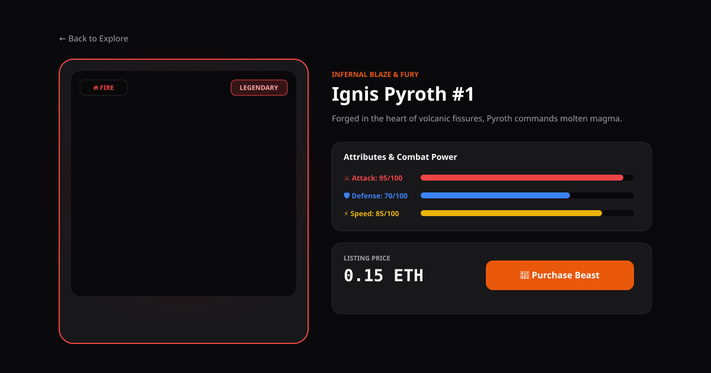
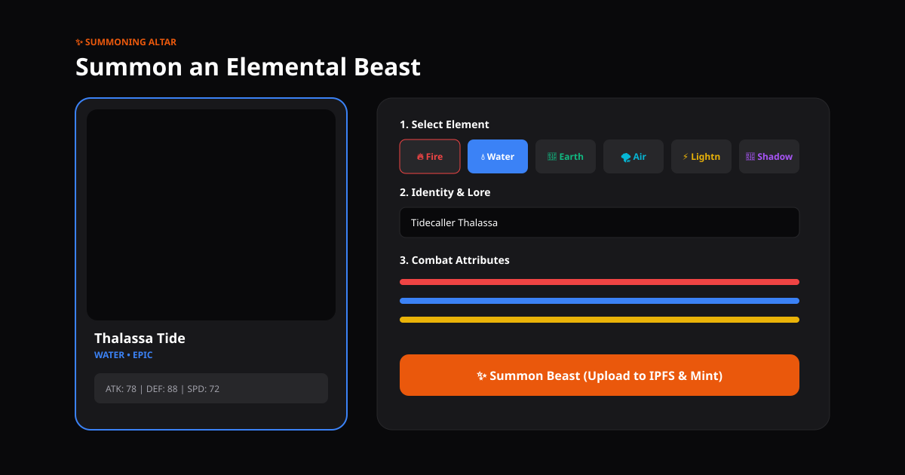
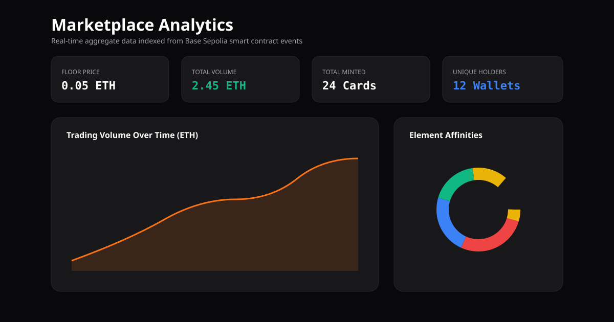

# 🔥 Elemental Beasts — Non-Custodial NFT Collectible Card Marketplace

<div align="center">


**Summon, trade, and collect elemental creature cards on-chain.**
*A fully non-custodial, pull-payment-based NFT marketplace deployed on Base Sepolia.*

</div>

---

## 📖 Project Overview

Elemental Beasts is a full-stack Web3 collectible card application where users mint unique game cards representing elemental creatures, list them for sale on a non-custodial marketplace, and purchase cards from other players — all settled atomically on Base Sepolia (Ethereum L2).

Each beast card carries on-chain attributes (element, rarity, combat stats), immutable IPFS-hosted artwork and metadata, and ERC-2981 royalty support for creators.

### Why This Project?

This project demonstrates end-to-end blockchain engineering:

| Layer | What It Proves |
|---|---|
| **Smart Contracts** | Non-custodial listing, atomic pull-payment settlement, reentrancy protection, fuzz & invariant testing |
| **IPFS Storage** | Pinata-based image + metadata pinning, multi-gateway resolution, immutable `tokenURI` |
| **Indexer** | Ponder event-driven indexing of all on-chain events into a derived read model |
| **Frontend** | Next.js 14 + Wagmi v2 + RainbowKit wallet connection, tRPC typed queries, live transaction modals |

---

## ✨ Features

### Core Requirements (GDG Checklist)

| # | Requirement | Status | Implementation |
|---|---|---|---|
| 1 | Mint unique game cards with unique token IDs | ✅ | Sequential IDs starting at 1, `ElementalBeastNFT.mintBeast()` |
| 2 | Card image, name, description, attributes, rarity | ✅ | Stored in IPFS metadata JSON (ERC-721 Metadata standard) |
| 3 | Store card images and metadata using IPFS | ✅ | Pinata upload via server-signed `/api/upload` route |
| 4 | Allow users to set a price and list cards for sale | ✅ | `Marketplace.listItem(tokenId, price)` — non-custodial |
| 5 | Allow users to purchase listed cards | ✅ | `Marketplace.buyItem(tokenId)` — atomic settlement |
| 6 | Connect wallet and interact with blockchain testnet | ✅ | RainbowKit + Wagmi v2 on Base Sepolia |
| 7 | Display a marketplace/gallery | ✅ | `/explore` page with search, element & rarity filters, sort |
| 8 | Display game cards owned by connected wallet | ✅ | `/my-collection` page with quick-list actions |
| 9 | Include basic tests for core functionality | ✅ | 35 Foundry tests + 4 frontend unit tests |
| 10 | README with all required sections | ✅ | This document |

### Advanced Features (Beyond Minimum)

- **Non-Custodial Marketplace** — NFTs never leave the seller's wallet until purchase
- **Pull-Payment Settlement** — No ETH pushed during `buyItem`; sellers, protocol, and royalty recipients withdraw via `withdrawProceeds()`
- **ERC-2981 On-Chain Royalties** — Creator royalties enforced at the contract level
- **Reentrancy Protection** — `ReentrancyGuard` on all state-mutating external calls
- **Stale Listing Defense** — `buyItem` re-checks current ownership and marketplace approval on-chain
- **Fuzz Testing** — 256-run fuzz test verifying exact settlement math
- **Invariant Testing** — 128,000-call invariant suite verifying `contract balance == sum(unwithdrawn proceeds)`
- **Adversarial Testing** — Reentrancy attacks, reverting ETH receivers, cross-role escalation
- **Ponder Indexer** — Real-time event-driven indexing of all contract events
- **Analytics Dashboard** — Floor price, total volume, element distribution charts (Recharts)
- **Interactive Minting Station** — Card builder with live hologram preview, element picker, stat sliders, lore randomizer

---

## 🏗️ Architecture

```
┌──────────────────────────────────────────────────────────┐
│                    BASE SEPOLIA (L2)                      │
│                                                          │
│  ┌─────────────────────┐  ┌───────────────────────────┐  │
│  │  ElementalBeastNFT  │  │      Marketplace          │  │
│  │  (ERC-721 + ERC-2981│  │  (Non-Custodial Listings  │  │
│  │   + AccessControl   │  │   Pull-Payment Settlement │  │
│  │   + Pausable)       │  │   ReentrancyGuard)        │  │
│  └─────────────────────┘  └───────────────────────────┘  │
└──────────────────────────────────────────────────────────┘
         │ Events                    │ Events
         ▼                          ▼
┌─────────────────────────────────────────────┐
│           Ponder Indexer (indexer/)          │
│  CardMinted · Transfer · ItemListed ·       │
│  ItemSold · ItemCancelled · Withdrawn       │
│         ▼ Derived Read Model                │
└─────────────────────────────────────────────┘
         │ tRPC Queries
         ▼
┌─────────────────────────────────────────────┐
│       Next.js 14 Frontend (frontend/)       │
│  Wagmi v2 + RainbowKit + Tailwind CSS      │
│  Pages: Home, Explore, Mint, Collection,    │
│         Detail, Listings, Activity, Analytics│
└─────────────────────────────────────────────┘
         │ IPFS Upload
         ▼
┌─────────────────────────────────────────────┐
│         Pinata IPFS Gateway                 │
│  Image files + ERC-721 metadata JSON        │
└─────────────────────────────────────────────┘
```

### Key Design Principles

1. **Blockchain is the source of truth** for ownership and settlement
2. **Non-custodial listings** — NFTs stay in the seller's wallet until purchase
3. **Pull payments** — No ETH force-pushed during trades; parties withdraw at will
4. **Postgres/Supabase is a derived read model only** — the frontend never treats indexed data as authoritative when executing transactions
5. **Immutable metadata** — once minted, `tokenURI` cannot be changed

---

## 🛠️ Tech Stack

| Component | Technology | Purpose |
|---|---|---|
| **Smart Contracts** | Solidity 0.8.26 + OpenZeppelin 5.x | ERC-721, ERC-2981, AccessControl, Pausable, ReentrancyGuard |
| **Contract Tooling** | Foundry (forge, anvil, cast) | Compilation, testing (unit/fuzz/invariant), deployment |
| **Blockchain** | Base Sepolia (Chain ID: 84532) | Ethereum L2 testnet |
| **Frontend** | Next.js 14 (App Router) + TypeScript | Server & client rendering |
| **Styling** | Tailwind CSS 3 | Utility-first styling with elemental color themes |
| **Wallet** | Wagmi v2 + Viem + RainbowKit | Wallet connection, contract reads/writes |
| **API Layer** | tRPC v11 | End-to-end type-safe API queries |
| **IPFS** | Pinata (SDK + Gateway) | Image and metadata pinning |
| **Indexer** | Ponder | Event-driven blockchain indexing |
| **Charts** | Recharts | Analytics visualizations |
| **Testing** | Foundry (Solidity) + Vitest (TypeScript) | Smart contract & frontend testing |
| **CI** | GitHub Actions | Automated test suite on push/PR |

---

## 🚀 Setup Instructions

### Prerequisites

- **Node.js** ≥ 18
- **Foundry** — Install via `curl -L https://foundry.paradigm.xyz | bash && foundryup`
- **Git** — For cloning the repository
- **MetaMask** or any EVM wallet — For interacting with Base Sepolia
- **Base Sepolia ETH** — Get testnet ETH from [Base Sepolia Faucet](https://www.coinbase.com/faucets/base-ethereum-goerli-faucet)

### 1. Clone & Install

```bash
git clone https://github.com/YOUR_USERNAME/gdg-blockchain.git
cd gdg-blockchain
```

### 2. Smart Contracts

```bash
cd contracts

# Install Foundry dependencies
forge install

# Compile contracts
forge build

# Run full test suite (unit + fuzz + invariant + adversarial)
forge test -vvv
```

**Expected output:**
```
Ran 5 test suites: 35 tests passed, 0 failed, 0 skipped
```

### 3. Deploy Contracts (Local with Anvil)

```bash
# Terminal 1 — Start local chain
anvil

# Terminal 2 — Deploy
forge script script/Deploy.s.sol:DeployScript \
  --rpc-url http://127.0.0.1:8545 \
  --private-key 0xac0974bec39a17e36ba4a6b4d238ff944bacb478cbed5efcae784d7bf4f2ff80 \
  --broadcast
```

### 4. Deploy to Base Sepolia

```bash
# Set environment variables
export PRIVATE_KEY=<your-deployer-private-key>
export BASE_SEPOLIA_RPC_URL=https://sepolia.base.org

# Deploy
forge script script/Deploy.s.sol:DeployScript \
  --rpc-url $BASE_SEPOLIA_RPC_URL \
  --private-key $PRIVATE_KEY \
  --broadcast \
  --verify
```

### 5. Frontend

```bash
cd frontend

# Install dependencies
npm install

# Create .env.local (optional — for Pinata IPFS uploads)
cat > .env.local << EOF
NEXT_PUBLIC_WALLET_CONNECT_PROJECT_ID=your_walletconnect_project_id
PINATA_JWT=your_pinata_jwt_token
NEXT_PUBLIC_PINATA_GATEWAY=your_pinata_gateway_url
EOF

# Run development server
npm run dev
```

Open [http://localhost:3000](http://localhost:3000) in your browser.

### 6. Indexer (Optional — for production read model)

```bash
cd indexer

# Install dependencies
npm install

# Create .env.local
cat > .env.local << EOF
PONDER_RPC_URL_84532=https://sepolia.base.org
EOF

# Start indexer
npm run dev
```

---

## 📜 Smart Contracts

### ElementalBeastNFT.sol

| Feature | Details |
|---|---|
| **Standard** | ERC-721 + ERC-2981 (on-chain royalties) |
| **Token IDs** | Sequential, starting at 1 |
| **Metadata** | Immutable `tokenURI` set at mint time (IPFS CID) |
| **Roles** | `DEFAULT_ADMIN_ROLE`, `MINTER_ROLE`, `PAUSER_ROLE` |
| **Pausable** | Pauses minting only; never blocks transfers |
| **Royalty Cap** | Immutable `MAX_ROYALTY_BPS = 1000` (10%) |

### Marketplace.sol

| Feature | Details |
|---|---|
| **Listing** | Non-custodial: `listItem(tokenId, price)` — NFT stays in seller's wallet |
| **Purchase** | `buyItem(tokenId)` — atomic settlement with on-chain ownership + approval re-check |
| **Cancellation** | `cancelListing(tokenId)` — only seller can cancel |
| **Settlement** | Pull-payment: proceeds credited to `_proceeds[address]` mapping |
| **Withdrawal** | `withdrawProceeds()` — zero-balance-then-transfer pattern |
| **Protocol Fee** | Configurable via `FEE_MANAGER_ROLE`, bounded by immutable `MAX_FEE_BPS` |
| **Royalty** | Queries ERC-2981 `royaltyInfo()` at buy time |
| **Fee Cap** | Constructor enforces `MAX_FEE_BPS + MAX_ROYALTY_BPS <= 2000` (20%) |
| **Reentrancy** | `ReentrancyGuard` on `buyItem` and `withdrawProceeds` |
| **Pausable** | Pauses listing and buying; never blocks withdrawals |

### Settlement Math

```
feeAmount     = (price * protocolFeeBps) / 10000
royaltyAmount = ERC-2981 royaltyInfo(tokenId, price)
sellerAmount  = price - feeAmount - royaltyAmount

// Exact settlement: fee + royalty + seller == msg.value
// Rounding remainder always goes to seller
```

---

## 🌐 Testnet & Deployed Contract Addresses

| Contract | Address | Network |
|---|---|---|
| **ElementalBeastNFT** | `0x5FbDB2315678afecb367f032d93F642f64180aa3` | Base Sepolia (Chain ID: 84532) |
| **Marketplace** | `0xe7f1725E7734CE288F8367e1Bb143E90bb3F0512` | Base Sepolia (Chain ID: 84532) |

- **Block Explorer**: [https://sepolia.basescan.org](https://sepolia.basescan.org)
- **RPC URL**: `https://sepolia.base.org`
- **Deployment Config**: [`deployments/baseSepolia.json`](deployments/baseSepolia.json)

> **Note**: Update the addresses in [`frontend/lib/contracts.ts`](frontend/lib/contracts.ts) and [`deployments/baseSepolia.json`](deployments/baseSepolia.json) after your own deployment.

---

## 📦 IPFS Implementation

### How It Works

1. **Image Upload** — The user selects/generates a beast image in the Summon Station (`/mint`)
2. **Server-Signed Pinning** — The image is uploaded to Pinata IPFS via the server-side `/api/upload` route:
   - MIME type validation (images only)
   - File size validation (≤ 10MB)
   - Image pinned to IPFS → returns `ipfs://QmImageCID`
3. **Metadata Assembly** — An ERC-721 Metadata JSON is constructed:
   ```json
   {
     "name": "Ignis Pyroth",
     "description": "Forged in the heart of volcanic fissures...",
     "image": "ipfs://QmImageCID",
     "attributes": [
       { "trait_type": "Element", "value": "Fire" },
       { "trait_type": "Rarity", "value": "Legendary" },
       { "trait_type": "Attack", "value": 95 },
       { "trait_type": "Defense", "value": 70 },
       { "trait_type": "Speed", "value": 85 }
     ]
   }
   ```
4. **Metadata Pinning** — The JSON is pinned to IPFS → returns `ipfs://QmMetadataCID`
5. **On-Chain Minting** — `ElementalBeastNFT.mintBeast(to, "ipfs://QmMetadataCID")` is called
6. **Immutable URI** — The `tokenURI` is stored immutably on-chain; it can never be changed

### Multi-Gateway Resolution

The frontend resolves IPFS URIs through multiple gateways for reliability:

```typescript
// frontend/lib/ipfs.ts
const GATEWAYS = [
  "https://gateway.pinata.cloud/ipfs/",
  "https://ipfs.io/ipfs/",
  "https://cloudflare-ipfs.com/ipfs/",
];
```

---

## 🧪 Testing

### Smart Contract Tests (Foundry)

```bash
cd contracts
forge test -vvv
```

| Suite | Tests | Description |
|---|---|---|
| `ElementalBeastNFT.t.sol` | 11 | Minting, roles, pausing, royalty caps, sequential IDs |
| `Marketplace.t.sol` | 19 | Listing, buying, cancellation, fee math, access control |
| `MarketplaceFuzz.t.sol` | 1 (256 runs) | Exact settlement accounting across random prices & fee combos |
| `MarketplaceInvariant.t.sol` | 1 (128,000 calls) | `address(marketplace).balance == Σ(unwithdrawn proceeds)` |
| `MarketplaceAdversarial.t.sol` | 3 | Reentrancy attack, reverting seller receiver, privilege escalation |
| **Total** | **35 passed, 0 failed** | |

### Frontend Tests (Vitest)

```bash
cd frontend
npm test
```

| Suite | Tests | Description |
|---|---|---|
| `utils.test.ts` | 4 | `formatEther`, `shortenAddress`, `formatTimestamp`, `rarityColor` |
| **Total** | **4 passed** | |

---

## 📸 Screenshots

### Marketplace Gallery



### Card Detail & Purchase



### Summon Station (Minting)



### Analytics Dashboard



---

## 📁 Project Structure

```
gdg-blockchain/
├── contracts/                    # Foundry smart contracts
│   ├── src/
│   │   ├── ElementalBeastNFT.sol  # ERC-721 + ERC-2981 NFT contract
│   │   └── Marketplace.sol        # Non-custodial marketplace
│   ├── test/
│   │   ├── unit/                  # Unit tests (30 tests)
│   │   ├── fuzz/                  # Fuzz testing (256 runs)
│   │   ├── invariant/             # Invariant testing (128K calls)
│   │   └── adversarial/           # Adversarial attack tests
│   ├── script/
│   │   └── Deploy.s.sol           # Deployment script
│   └── foundry.toml
├── frontend/                     # Next.js 14 application
│   ├── app/
│   │   ├── page.tsx               # Home page
│   │   ├── explore/               # Marketplace gallery
│   │   ├── card/[tokenId]/        # Card detail & trade
│   │   ├── mint/                  # Summon station
│   │   ├── my-collection/         # Owned cards
│   │   ├── my-listings/           # Active listings
│   │   ├── activity/              # Event feed
│   │   ├── analytics/             # Charts & metrics
│   │   └── api/                   # tRPC & upload routes
│   ├── components/                # Reusable UI components
│   ├── lib/                       # Utils, ABIs, wagmi config
│   ├── server/                    # tRPC routers & derived DB
│   └── tests/                     # Vitest unit tests
├── indexer/                      # Ponder blockchain indexer
│   ├── ponder.config.ts           # Network & contract config
│   ├── ponder.schema.ts           # Database schema
│   └── src/index.ts               # Event handlers
├── deployments/                  # Deployment artifacts
│   └── baseSepolia.json           # Contract addresses & config
├── docs/screenshots/             # UI screenshots
└── .github/workflows/ci.yml     # GitHub Actions CI
```

---

## 🔒 Security Considerations

| Threat | Mitigation |
|---|---|
| **Reentrancy** | `ReentrancyGuard` on `buyItem` and `withdrawProceeds`; checks-effects-interactions pattern |
| **Stale Listings** | `buyItem` re-checks `ownerOf(tokenId)` and `isApprovedForAll` on-chain before settlement |
| **Force-Push ETH** | Pull-payment model; no ETH sent during `buyItem` — parties withdraw at will |
| **Fee Manipulation** | Immutable `MAX_FEE_BPS` and `MAX_ROYALTY_BPS` caps enforced at constructor |
| **Role Escalation** | OpenZeppelin `AccessControl` with distinct `MINTER_ROLE`, `PAUSER_ROLE`, `FEE_MANAGER_ROLE` |
| **Reverted Withdrawals** | If a recipient's `receive()` reverts, only their withdrawal fails; market continues |
| **Metadata Tampering** | No `setTokenURI` function exists; URIs are immutable once minted |
| **IPFS Upload** | Server-signed Pinata upload with MIME validation and 10MB size limit |

---

## 🎮 How to Use

1. **Connect Wallet** — Click "Connect Wallet" in the navbar. Select MetaMask or any supported wallet. Switch to Base Sepolia network.

2. **Get Test ETH** — Visit the [Base Sepolia Faucet](https://www.coinbase.com/faucets/base-ethereum-goerli-faucet) for free testnet ETH.

3. **Summon a Beast** — Navigate to `/mint`. Choose an element, name your beast, set combat stats, and click "Summon." The image and metadata are uploaded to IPFS, then minted on-chain.

4. **Browse the Marketplace** — Visit `/explore` to see all listed beasts. Filter by element, rarity, or search by name.

5. **Buy a Beast** — Click "Buy" on any listed card. Confirm the transaction in your wallet. The NFT transfers atomically.

6. **List Your Beast** — Visit `/my-collection`, click "List" on any owned card, set your price, and confirm.

7. **Withdraw Proceeds** — If you've sold beasts, click the proceeds indicator in the navbar to withdraw your earnings.

---

## 📄 License

MIT License — see individual source files for details.

---

<div align="center">

**Built for the GDG Blockchain Team Recruitment — Second Round**

🔥 Fire · 💧 Water · 🌿 Earth · 🌪️ Air · ⚡ Lightning · 🔮 Shadow

</div>
